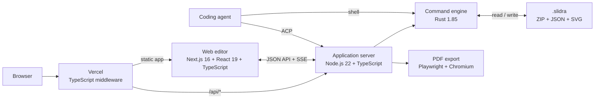

<!-- <p align="center">
  
</p> -->

<h1 align="center">Slidra</h1>

<p align="center">
  <b>The slide harness for coding agents.</b><br>
  One presentation, with native interfaces for humans and agents.
</p>

<p align="center">
  <a href="LICENSE"></a>
  <!-- Public demo link intentionally hidden until launch. -->
</p>

<!-- <p align="center">
  
</p> -->

---

## Why Slidra?

Coding agents can generate slide decks. Slidra helps humans and agents keep improving them together.

Most AI slide workflows stop at generation:

```text
Prompt → Deck
```

Real presentation work does not:

```text
Prompt → Draft → Review → Edit → Validate → Present
```

Without persistent structure, every revision risks becoming another generation task. Slidra turns a deck into an inspectable, editable, and validatable document instead.

- **Humans** edit visually in the GUI.
- **Agents** inspect and modify the deck through a structured CLI.
- **Both** work on the same `.slidra` file.

> Read the full rationale in [Why Slidra When AI Can Already Generate Slides](docs/why-Slidra-when-AI-can-already-generate-slides.md) ([繁體中文](docs/why-Slidra-when-AI-can-already-generate-slides_zh.md)).

---

## How It Works

Slidra provides four boundaries for reliable agent workflows:

| Boundary | Component | Purpose |
| --- | --- | --- |
| **Representation** | `.slidra` format | Makes the deck inspectable |
| **Action** | CLI | Defines what can be changed |
| **Behavior** | Skills and guidance | Defines how work should proceed |
| **Validation** | Executable validators | Defines what must remain true |

The agent can inspect the current state, make a bounded change, validate the result, and continue refining it.

```text
Human ── Visual Editor ──┐
                         ├── CLI ── .slidra
Agent ───────────────────┘
```

The GUI routes supported edits through the same command layer used by agents. This preserves object identity and document continuity across visual edits, CLI operations, undo, and redo.

---

## Architecture

Slidra is a monorepo with a Next.js and React web editor, a resident Node.js server, and a Rust CLI that owns every deck command. The web editor never edits a `.slidra` deck directly: human edits, agent requests, reads, validation, undo, and redo all pass through the same CLI command boundary.



| Component | Frameworks and languages | Responsibility |
| --- | --- | --- |
| Web editor | Next.js 16, React 19, TypeScript, HTML, CSS | Renders the visual editor and translates human interactions into API requests. It is statically exported to `apps/web/dist` for both local serving and Vercel. |
| Application server | Node.js 22, TypeScript, native `node:http` | Runs `slidra serve`, exposes the JSON and SSE endpoints, manages ACP agent sessions, and coordinates export jobs. |
| CLI and domain engine | Rust 1.85, Rust 2024 Edition, Clap, Serde | Implements semantic deck commands, validation, undo and redo, and `.slidra` container access. This is the authoritative mutation boundary. |
| Agent integration | Agent Client Protocol, TypeScript | Connects Claude Code or Codex to the resident server while keeping deck changes inside the CLI command surface. |
| PDF renderer | Playwright, Chromium, TypeScript | Loads the same Next.js `export.html` route and renders the deck into PDF. |
| Deck storage | ZIP, JSON, SVG | Stores the manifest, ordered slides, templates, assets, fonts, and optional planning documents in one `.slidra` file. |
| Hosted demo edge | Vercel Routing Middleware, TypeScript, Cloudflare Tunnel, nginx | Authenticates visitors, serves the Next.js static export, and forwards authenticated `/api/*` traffic to the private `slidra serve` origin. |

The local and hosted paths use the same frontend build and the same server and CLI contracts. Vercel hosts the static Next.js output and protects the public edge; it does not replace the stateful Node.js server or the Rust command engine.

---

## The `.slidra` Format

A `.slidra` file is a ZIP container with an explicit project manifest and authoritative SVG slides:

```text
deck.slidra
├── project.json      # format, name, canvas, and slide order
├── slides/
│   ├── 001.svg
│   └── 002.svg
├── templates/        # optional reusable layouts
├── assets/
├── fonts/
└── plan/             # optional outline and design specification
```

`project.json` declares the slide order, canvas size, and format version. Each slide is stored as SVG, with presentation semantics layered on top:

- Stable `el-`-prefixed object IDs
- Object names, locking, groups, and z-order
- Packaged assets and fonts
- Addressable charts and tables
- Speaker notes and element-pinned comments
- Object animations and slide transitions
- Templates and design-plan metadata

The result is a persistent document that both humans and agents can inspect and edit without reconstructing the deck.

---

## CLI

Slidra provides 88 commands for precise presentation editing:

| Family | Examples |
| --- | --- |
| Presentation | `new`, `open`, `pack`, `cat`, `ls`, `undo`, `redo` |
| Text | `text set`, `text style set`, `textbox add`, `textbox align` |
| Elements | `element move`, `resize`, `rotate`, `group`, `align`, `distribute` |
| Tables | `table create`, `table cell set`, `table row insert`, `table bind` |
| Charts | `chart create`, `chart data set`, `chart type set`, `chart axis set` |
| Motion | `effect add`, `effect set`, `slide transition set` |
| Slides | `slide add`, `slide set`, `slide background set`, `slide render` |
| Resources | `template add`, `comment add`, `font import`, `asset import`, `plan set` |
| Validation | `validate` |

A typical agent workflow looks like this:

```sh
# Inspect
slidra ls <deck-id> slides
slidra cat <deck-id> slides/001.svg

# Edit one object
slidra text set <deck-id> slides/001.svg el-title "A New Title"
slidra element move <deck-id> slides/001.svg el-image --dx 20 --dy 0

# Validate
slidra validate <deck-id> --json
```

A request to move one image should move one image—not regenerate the slide.

Every command returns:

```json
{ "ok": true, "data": {}, "message": "", "failureKind": null }
```

Commands exit with code `0` on success and `1` on failure. Add `--json` for single-line, script-friendly output.

---

## Validation

Slidra reports concrete, machine-readable findings:

```json
{
  "checked": 6,
  "errors": [
    {
      "slide": "slides/002.svg",
      "element": "el-abc",
      "rule": "text.bullet-length",
      "actual": "37 characters",
      "limit": "≤ 32 characters",
      "message": "Page 2, bullet 3 has 37 characters, limit is 32"
    }
  ]
}
```

Validation covers:

- Geometry and overflow
- Text density and font size
- Style and contrast constraints
- Backgrounds, notes, templates, and scrims
- Animations and transitions
- Page roster and visual rhythm
- Diagram roles and blueprints
- Presentation taboos

Geometry, structure, and taboo rules run on every deck. Additional rules activate when the deck includes `plan/outline.md` or `plan/design-spec.md`.

When validation finds issues, the command exits non-zero but still returns `ok: true`: the validation ran successfully and produced findings.

> Validation enables a reliable feedback loop. It does not replace visual judgment or automatically repair every issue.

---

## Human–Agent Workflow

```text
Agent drafts the deck
  → Human adjusts the layout
  → Human pins a comment to an object
  → Agent edits that object through the CLI
  → The canvas updates
  → Validation reports remaining issues
  → Human or agent makes the next correction
```

This workflow lets you:

- Start with AI without becoming trapped in generated output
- Make targeted changes without regenerating the deck
- Preserve object identity across the GUI, CLI, comments, and validation
- Move fluidly between direct manipulation and agent-driven editing

---

## Built for Both Sides

### UX-friendly for humans

The visual editor supports selection, dragging, resizing, rotation, alignment, grouping, text and style editing, animations, comments, undo/redo, playback, and fullscreen presenting.

### AX-friendly for agents

The CLI exposes stable object IDs, semantic operations, structured output, composable commands, and executable validation.

Agents do not need to imitate mouse actions. They can operate directly on presentation semantics.

---

## Quickstart

```sh
git clone https://github.com/Noopher-AI/slidra.git
cd slidra
npm run verify:setup
```

This installs dependencies, builds the CLI, and starts a local server (`slidra serve`) with a demo
deck open in the web editor.

To begin with an empty deck instead:

```sh
npm run verify:setup -- --blank
```

From there, point an agent at the CLI shown in [CLI](#cli): inspect the deck with `ls`/`cat`, make a
bounded edit, and run `validate`.

---

## Web editor

`slidra serve` (started for you by `npm run verify:setup`) serves the visual editor in `apps/web`
alongside the deck. It supports selecting, dragging, resizing, rotating, grouping, and aligning
objects, editing text and styles, and pinning comments to elements — every edit routes through the
same CLI command layer an agent uses, so object identity is preserved across GUI and CLI edits (see
[How It Works](#how-it-works)). `serve` also wires up a chat connection to an agent (Claude Code or
Codex, via ACP), so you can prompt changes for the open deck without leaving the editor.

---

## Contributing

Read [CONTRIBUTING.md](CONTRIBUTING.md) for the development setup, branching, and DCO sign-off
requirements. Issues labeled
[`good first issue`](https://github.com/Noopher-AI/slidra/labels/good%20first%20issue) are a good
place to start. Changes to the `.slidra` file format go through an RFC under `spec/rfcs/` rather than
a direct PR.

---

## License

[Apache-2.0](LICENSE)
