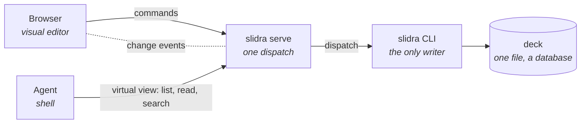
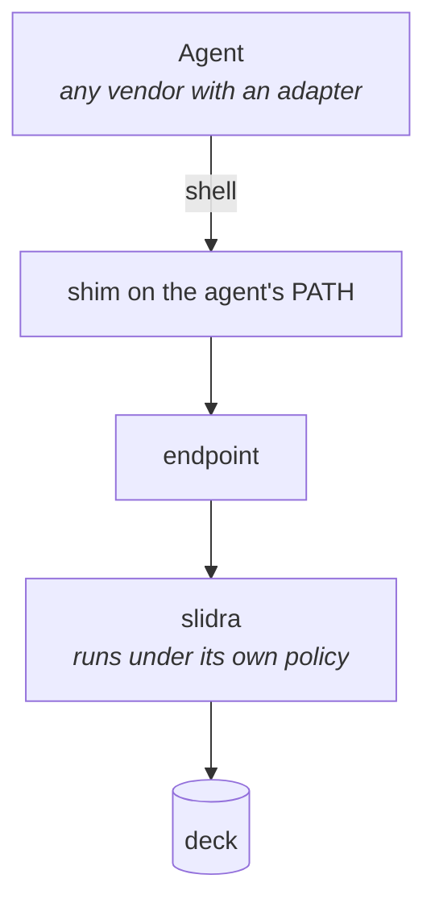

# Architecture

One binary, one deck file, two editors that share a single vocabulary.

This document is the overview. Every claim here is a consequence of a decision recorded in
`.dev_docs/adr/`, and the records are where the reasoning lives — this file does not repeat it.

## The shape

| Part | What it is |
| --- | --- |
| `crates/slidra` | The Rust CLI. The only thing that reads or writes a deck |
| `packages/server` | The resident mode of that CLI. Bridges the browser and the agent |
| `packages/web` | The visual editor, served by that server |
| The deck | One file, a database, edited in place |

`slidra serve` is not a separate backend. It is a subcommand that execs into Node and shares
one dispatch with the one-shot commands, which is what makes "the frontend can only do what the
CLI can do" a structural guarantee rather than a convention (ADR-0002).

## Four boundaries

Each answers a different question, and they are deliberately separate.

| Boundary | Component | Answers |
| --- | --- | --- |
| Representation | The `.slidra` format | What a deck *is* |
| Action | The `slidra` CLI | What may be *changed* |
| Behaviour | Skills and the editing charter | How work should *proceed* |
| Verification | `slidra validate` | What must stay *true* |

## The command path

Nothing reaches deck content except through a command.



A drag in the editor is a local preview until the gesture ends; releasing dispatches one
command. **One gesture, one command, one undo step** (ADR-0002).

The agent never sees a real filesystem path. It gets a virtual view of deck content — it can
read everything and write nothing, and a refused write names the command to use instead
(ADR-0003). Taking file reading away means giving it back deliberately, which is why listing,
reading and searching exist as commands: without them every inspection costs a full read of
every slide.

## The deck

One file, and it is a database rather than an archive (ADR-0011). There is no hidden working
copy; the file the person holds *is* the workspace. Editing one slide writes an amount of data
unrelated to the deck's total size.

What is inside:

- A slide is **self-contained** — its graphics, identifiers, effect list, transitions and
  comments all live in its own SVG. The deck level keeps only what spans slides: format version,
  name, canvas, and slide order (ADR-0005). Swapping two slides is swapping two strings in an
  order array.
- Motion is an **ordered list of effects**, each pointing at exactly one element (ADR-0006).
  Steps are derived from triggers, never stored.
- An element is a **container wrapping its primitives**, with position and rotation only on the
  container's transform (ADR-0008).
- Fonts travel **inside the deck**. A slide opened elsewhere falls back to system fonts — the
  one exception to ADR-0001 (ADR-0010).
- Conversation history and undo history live in the same file without being part of the deck's
  addressable content, so copying the file carries them along.

## Rendering and trust

A deck is meant to be opened by people other than its author, and valid SVG can carry event
handlers. Slide content is therefore **always untrusted** (ADR-0007): it renders in a sandboxed
frame from an opaque origin, scripts are enabled only for the app's own reporting runtime, and
same-origin is never granted — the two flags together would let the content escape the sandbox.

The server must refuse requests carrying an opaque origin. Enabling scripts and refusing those
requests are two halves of one decision; doing only the first is worse than doing neither.

## The agent path

The app is a client of a published agent protocol (ADR-0004). It does not implement an agent,
and it does not own the person's relationship with their agent vendor.



What the agent finds on its `PATH` is not the real binary — it is a wrapper that forwards
through an endpoint to a CLI running under its own policy. Writes outside the agent's own
scratch area are refused by the operating system, not by inspecting the command string.

**What the sandbox does and does not do:** it restricts what the agent may *write*. Reads and
outbound network are deliberately open, because the agent's own tools depend on them. It is not
a defence against prompt injection — an agent that reads hostile text and acts on it is a chain
this edition leaves open, knowingly. On a person's own machine that is a defensible posture.
A hosted, multi-tenant product has to close it by other means.

## Repository layout

```
crates/slidra/      The CLI. Rust. The only reader and writer of deck content.
packages/server/    slidra serve. Command dispatch, change events, the agent bridge.
packages/web/       The visual editor and the playback runtime.
docs/spec/          Facts that move with the version: the format, the CLI, the workspace.
.dev_docs/adr/      Decisions that do not.
e2e/                Browser tests across the whole path.
```

## Decisions behind this

| | |
| --- | --- |
| ADR-0001 | SVG is the slide artifact |
| ADR-0002 | The CLI is the only vocabulary |
| ADR-0003 | Deck content is read-only to agents |
| ADR-0004 | Agents attach through a published protocol |
| ADR-0005 | A slide is self-contained |
| ADR-0006 | Motion is an ordered list of effects |
| ADR-0007 | Slide content is untrusted |
| ADR-0008 | Every element is framed in a transform group |
| ADR-0009 | Templates replace masters, and a template dies on use |
| ADR-0010 | Fonts are packaged; a standalone slide degrades |
| ADR-0011 | A deck is a database, not an archive |
| ADR-0012 | A deck has an owner |
| ADR-0013 | An extracted module takes a named dependency object |

The commercial edition builds on these and records its own decisions separately; it cites these
as `ADR-NNNN (oss)`.
